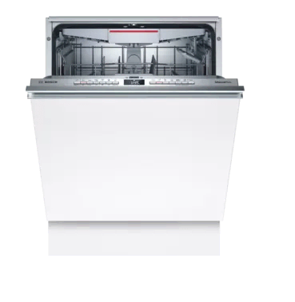

# Python application to talk to Home Connect appliances over the local network (no cloud required)


## No-cloud local control Bosch Home Connect Devices

Interface for Bosch-Siemens Home Connect devices through their local network connection. 
Unlike most IoT devices that have a reputation for very bad security,  BSG seem to have done a decent job of designing their system, especially since they allow a no-cloud local control configuration. 


## Installation

On a modern Linux system just a few steps are needed to get the daemon working. The following example shows the installation below the /app directory:

```bash
⚡ > su -
⚡ > cd /app/
⚡ > git clone https://github.com/zibous/home-connect-mqtt.git
⚡ > cd /app/home-connect-mqtt
⚡ > sudo pip3 install -r requirements.txt
```


## Configuration


To match personal needs, all operation details can be configured using the file `app_config.py` The file needs to be created first:

```bash
⚡ >  cd /app/home-connect-mqtt/config
⚡ >  cp app_config.py.dist app_config.py

# edit configuration settings
⚡ > nano app_config.py
```

### app_config settings

| settings   |     remark |
|----------|-------------|
| LOGGER_LEVEL |  100  (only info) |
| DATEFORMAT* |   see settings |
| MQTT_HOST | Mqtt host, if None = disabled |
| DEVICES | email,password for bosch cloud |

<br>


```yaml
DEVICES = {
    "bosch": {
        "email": "",                                       ## BOSCH CLOUD USERNAME 
        "password": "",                                    ## BOSCH CLOUD PASSWORD
        "1234567890": {                                    ## DEVICE SERIALNUMBER 
            "hostname": "bosch-dishwasher.siebler.home",   ## HOSTNAME DHCP SERVER
            "installed": "2022-09-06 12:00:00",            ## DATE ADOPTED DEVICE
            "taps": 20,                                    ## optional
            "taps_min": 5,                                 ## optional 
            "topics": {                                    ## full state mappings for mqtt state topic
                "OperationState": "state",
                "DoorState": "door",
                "RemainingProgramTime": "remaining",
                "PowerState": "power",
                "InternalError": "error",
                "FatalErrorOccured": "error",
                "ProgramPhase": "programm",
                "HalfLoad": "halfload",
                "ProgramFinished": "programend",
                "ProgramProgress": "progress",
                "AquaStopOccured": "waterleak",
                "LowWaterPressure": "lowwater",
                "CheckFilterSystem": "checkfilter"
            }
        }
    }
}
```
<br>
All others are optional.

<br>

## Testcase 

The section `testcase` holds simple testcases for:

  - Login Home Connect appliances to get the devices settings
  - Homeassistant MQTT Discovery Service
  - Testcase MQTT for the registrated Devices

## Run the python application

`python3 app.py -l INFO`

## Install python application as service

You most probably want to execute the program continuously in the background.  Systemd service for - on systemd powered systems the recommended option

```bash
⚡ > sudo cp template_service.service /etc/systemd/system/home-connect-mqtt.service

⚡ > sudo systemctl daemon-reload
⚡ > sudo systemctl start home-connect-mqtt.service
⚡ > sudo systemctl stop home-connect-mqtt.service
⚡ > sudo systemctl status home-connect-mqtt.service

⚡ > sudo systemctl enable home-connect-mqtt.service
```

## Devices

### Bosch Dishwasher
The dishwasher has a local HTTPS port open, although attempting to connect to the HTTPS port with curl results in a  cryptic protocol error due to the non-standard cipher selection, ECDHE-PSK-CHACHA20-POLY1305. 



PSK also requires that both sides agree on a symetric key, so a special hacked version of sslpsk is used to establish the connection and then hand control to the Python websock-client library.
<br>

Example message published to `tele/bosh/dishwasher/state`:

```json
{
	"state": "Ready",
	"door": "Closed",
	"remaining": "1:05",
	"power": "Off",
	"lowwater": "Off",
	"waterleak": "Off",
	"error": "Off",
	"programm": "None",
	"halfload": "False",
	"programend": "Off",
	"progress": "False",
	"checkfilter": "Off",
	"remainingseconds": 3900,
	"tapscounter": 1,
	"tapsorder": "",
	"device": "BOSCH-Dishwasher-012090517380017161",
	"timestamp": "2022-10-20T09:18:51",
	"dataprovider": "zeusus",
	"attribution": "Data dishwasher.service provided by Peter Siebler"
}
```
With the status topic only the messages contained in the configuration `devices.brand.serialnumber.topics` are published, this can be adjusted by further (see Full state information).


<details>
<summary>Full state information</summary>

```json
{
  "AllowBackendConnection": "false",
  "BackendConnected": "false",
  "RemoteControlLevel": "ManualRemoteStart",
  "SoftwareUpdateAvailable": "Off",
  "ConfirmPermanentRemoteStart": "Off",
  "ActiveProgram": 0,
  "SelectedProgram": 8192,
  "RemoteControlStartAllowed": "false",
  "520": "2022-02-21T16:48:54",
  "RemoteControlActive": "true",
  "AquaStopOccured": "Off",
  "DoorState": "Open",
  "PowerState": "Off",
  "ProgramFinished": "Off",
  "ProgramProgress": 100,
  "LowWaterPressure": "Off",
  "RemainingProgramTime": 0,
  "ProgramAborted": "Off",
  "547": "false",
  "RemainingProgramTimeIsEstimated": "true",
  "OperationState": "Inactive",
  "StartInRelative": 0,
  "EnergyForecast": 82,
  "WaterForecast": 70,
  "ConnectLocalWiFi": "Off",
  "SoftwareUpdateTransactionID": 0,
  "SoftwareDownloadAvailable": "Off",
  "SoftwareUpdateSuccessful": "Off",
  "ProgramPhase": "Drying",
  "SilenceOnDemandRemainingTime": 0,
  "EcoDryActive": "false",
  "RinseAid": "R04",
  "SensitivityTurbidity": "Standard",
  "ExtraDry": "false",
  "HotWater": "ColdWater",
  "TimeLight": "On",
  "EcoAsDefault": "LastProgram",
  "SoundLevelSignal": "Off",
  "SoundLevelKey": "Medium",
  "WaterHardness": "H04",
  "DryingAssistantAllPrograms": "AllPrograms",
  "SilenceOnDemandDefaultTime": 1800,
  "SpeedOnDemand": "false",
  "InternalError": "Off",
  "CheckFilterSystem": "Off",
  "DrainingNotPossible": "Off",
  "DrainPumpBlocked": "Off",
  "WaterheaterCalcified": "Off",
  "LowVoltage": "Off",
  "SaltLack": "Off",
  "RinseAidLack": "Off",
  "SaltNearlyEmpty": "Off",
  "RinseAidNearlyEmpty": "Off",
  "MachineCareReminder": "Off",
  "5121": "false",
  "HalfLoad": "false",
  "IntensivZone": "false",
  "VarioSpeedPlus": "false",
  "5131": "false",
  "5134": "true",
  "SilenceOnDemand": "false"
}
```
</details>

<br>
Example message published to `tele/bosh/dishwasher/heartbeat`:

```json
{
	"state": "on",
	"device": "dishwasher",
	"uptime": "14 hours, 12 minutes, 26 seconds",
	"totalrunning": "43 days, 22 hours, 54 minutes, 21 seconds",
	"tabs": 20,
	"tabsmin": 5,
	"timestamp": "2022-10-20T10:54:21",
	"dataprovider": "zeusus",
	"attribution": "Data dishwasher.service provided by Peter Siebler"
}
```
<br>
<hr>


<br>
# Acknowledgements:

+ Thanks to Trammell Hudson osresearch  https://github.com/osresearch/hcpy
