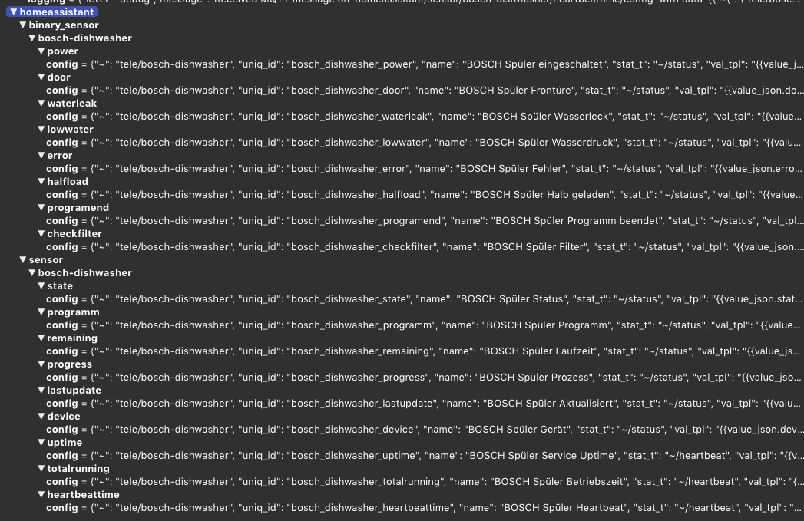

# Simple Testcases

This section holds simple testcases for:

  - Login Home Connect appliances to get the devices settings
  - Homeassistant MQTT Discovery Service
  - Testcase MQTT for the registrated Devices


## Testcase Authenticate to the cloud servers

The hc-login script perfoms the OAuth process to login to your Home Connect account with your usename and password. 

```bash
 ⚡ > cd /app/home-connect-mqtt/test
 ⚡ > python3 ha-login.py
```

### Result:
It receives a bearer token that can then be used to retrieves a list of all the connected devices, their authentication and encryption keys, and XML files that describe all of the features and options.

Creates the `config/devices.json` and the `config/{brand}/{maschine}/maschine.json` for all registrated devices.


This only needs to be done once or when you add new devices; the resulting configuration JSON file should be sufficient to connect to the devices on your local network, assuming that your mDNS or DNS server resolves the names correctly.

<br>

## Testcase Home Connect to HA Disccovery

```bash
 ⚡ > cd /app/home-connect-mqtt/test
 ⚡ > python3 ha-discovery.py
```

### Result:



## Testcase Home Connect to MQTT

This tool will establish websockets to the local devices and transform their messages into MQTT JSON messages. 

```bash
 ⚡ > cd /app/home-connect-mqtt/test
 ⚡ > python3 ha-mqtt.py
```

The exact format is likely to change; it is currently a thin translation layer over the XML retrieved from cloud servers during the initial configuration.


### Result:

Example message published to `tele/bosh/dishwasher/state`:

```json
{
	"state": "Ready",
	"door": "Closed",
	"remaining": "1:05",
	"power": "Off",
	"lowwater": "Off",
	"waterleak": "Off",
	"error": "Off",
	"programm": "None",
	"halfload": "False",
	"programend": "Off",
	"progress": "False",
	"checkfilter": "Off",
	"remainingseconds": 3900,
	"tapscounter": 1,
	"tapsorder": "",
	"device": "BOSCH-Dishwasher-012090517380017161",
	"timestamp": "2022-10-20T09:18:51",
	"dataprovider": "zeusus",
	"attribution": "Data dishwasher.service provided by Peter Siebler"
}
```

<br>
Example message published to `tele/bosh/dishwasher/heartbeat`:

```json
{
	"state": "on",
	"device": "dishwasher",
	"uptime": "14 hours, 12 minutes, 26 seconds",
	"totalrunning": "43 days, 22 hours, 54 minutes, 21 seconds",
	"tabs": 20,
	"tabsmin": 5,
	"timestamp": "2022-10-20T10:54:21",
	"dataprovider": "zeusus",
	"attribution": "Data dishwasher.service provided by Peter Siebler"
}
```
<br>
<hr>

# Acknowledgements:

+ Thanks to Trammell Hudson osresearch  https://github.com/osresearch/hcpy
